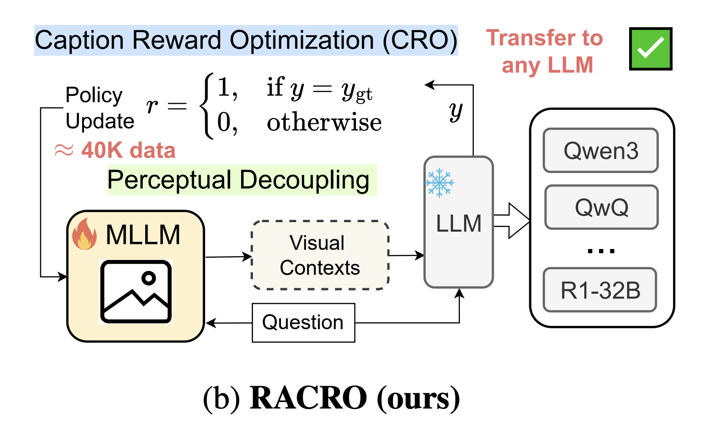
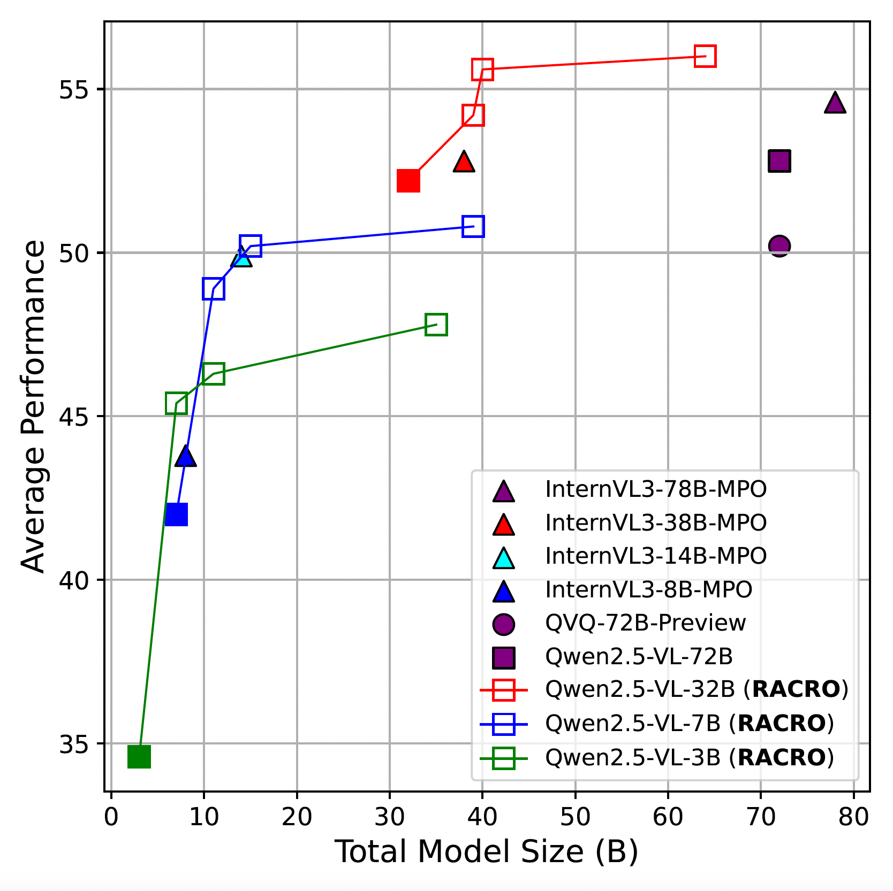
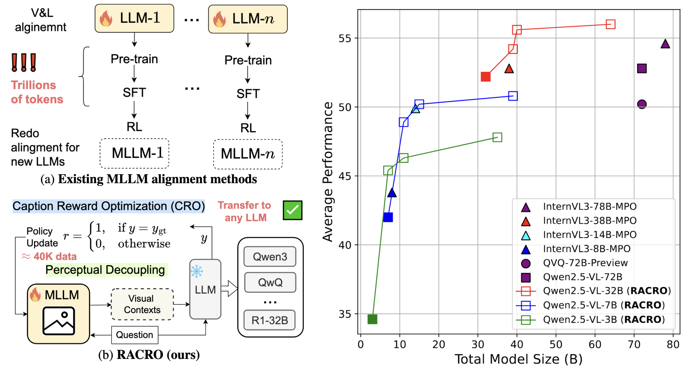
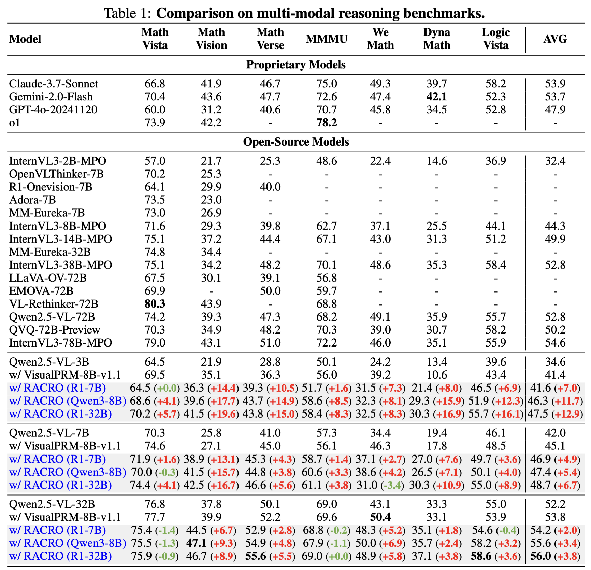

<div align="center">


# Perceptual Decoupling for Scalable Multi-modal Reasoning via Reward-Optimized Captioning


📄 [Paper](https://arxiv.org/abs/2506.04559) | 💻 [Github](https://github.com/gyhdog99/RACRO2/) | 🤗 [RACRO-Models](https://huggingface.co/collections/KaiChen1998/racro-6848ec8c65b3a0bf33d0fbdb) | 🤗 [RACRO-Demo]()

</div>


This repository provides training, inference, and evaluation instructions for the paper:

> Perceptual Decoupling for Scalable Multi-modal Reasoning via Reward-Optimized Captioning <br>
> [Yunhao Gou*](https://gyhdog99.github.io/), [Kai Chen*](https://kaichen1998.github.io/), [Zhili Liu*](https://scholar.google.com/citations?user=FdR09jsAAAAJ), [Lanqing Hong](https://scholar.google.com/citations?hl=zh-CN&user=2p7x6OUAAAAJ&view_op=list_works&sortby=pubdate), [Xin Jin](https://scholar.google.com.hk/citations?user=EwOxofEAAAAJ&hl=zh-CN), [Zhenguo Li](https://scholar.google.com/citations?user=XboZC1AAAAAJ&hl=zh-CN), [James T. Kwok](https://www.cse.ust.hk/~jamesk/) , [Yu Zhang](https://yuzhanghk.github.io/)


## ⚡ News

- **[2025-06]** 🔥 We have released the [RACRO-7B-CRO](https://huggingface.co/KaiChen1998/RACRO-7B-CRO) and [RACRO-7B-CRO-GRPO](https://huggingface.co/KaiChen1998/RACRO-7B-CRO-GRPO) checkpoints on HuggingFace!

## 📖 Introduction
This paper introduces **Reasoning-Aligned Perceptual Decoupling via Caption Reward Optimization (RACRO)**, a novel framework that enables scalable and modular multimodal reasoning by aligning visual perception with a powerful text-only reasoner. RACRO addresses the key challenge of generating image captions that are both faithful and sufficiently informative for downstream reasoning. It leverages a reasoning-guided reinforcement learning strategy to train the visual extractor, using reward signals derived from the performance of a fixed, high-capacity text-only LLM. This decoupled design avoids costly retraining of vision-language alignments and allows seamless plug-and-play upgrades to more advanced reasoners. Experiments on multimodal math and science benchmarks show that RACRO achieves **state-of-the-art** performance among open models.

<!-- <div align="center" style="display: flex; justify-content: center; gap: 20px;">
  
  
</div> -->

<div align="center">
  </img>
</div>


## 📈 Results

<div align="center">
  </img>
</div>

## Contents

- 


## 🎯 Model Zoos

| **Model**                          | **Dataset**                          | **🤗 Huggingface** |  **Base Model** |
|:---------------------------------:|:---------------------------------:|:----------------:|:----------------:|
| RACRO-3B-CRO | [ViRL39K](https://huggingface.co/datasets/TIGER-Lab/ViRL39K) | TBD |  [Qwen2.5-VL-3B-Instruct](https://huggingface.co/Qwen/Qwen2.5-VL-3B-Instruct) |
| RACRO-3B-CRO-GRPO | [ViRL39K](https://huggingface.co/datasets/TIGER-Lab/ViRL39K) | TBD | [Qwen2.5-VL-3B-Instruct](https://huggingface.co/Qwen/Qwen2.5-VL-3B-Instruct) |
| RACRO-7B-CRO | [ViRL39K](https://huggingface.co/datasets/TIGER-Lab/ViRL39K) | [[Link]](https://huggingface.co/KaiChen1998/RACRO-7B-CRO) |  [Qwen2.5-VL-7B-Instruct](https://huggingface.co/Qwen/Qwen2.5-VL-7B-Instruct) |
| RACRO-7B-CRO-GRPO | [ViRL39K](https://huggingface.co/datasets/TIGER-Lab/ViRL39K) | [[Link]](https://huggingface.co/KaiChen1998/RACRO-7B-CRO-GRPO) | [Qwen2.5-VL-7B-Instruct](https://huggingface.co/Qwen/Qwen2.5-VL-7B-Instruct) |

## 🔧 Installation

```bash
# Create conda environment
conda create -n racro python==3.11
conda activate racro

# Install dependencies
cd verl-main
pip install -r requirements.txt

# Install flash-attention (see: https://github.com/Dao-AILab/flash-attention/releases)
# Follow the instructions for your CUDA version

# Install verl-main
pip install -e .

# Install VLMEvalKit
cd ../VLMEvalKit
pip install -e .
```

## 🔥 Quick Start with vLLM

TBD

## 🏋️‍♂️ Training

1. Prepare training data <br/>
Download [ViRL39K dataset](https://huggingface.co/datasets/TIGER-Lab/ViRL39K) and preprocess it:

```bash
python verl-main/examples/data_preprocess/virl39k_pre.py \
  --src-parquet /cache/data/datasets/ViRL39K/39Krelease.parquet \
  --tgt-dir /cache/data/huggingface_datasets/virl39k_hf_no_deepscaler 

python verl-main/examples/data_preprocess/virl39k.py \
  --src-hf-dataset /cache/data/huggingface_datasets/virl39k_hf_no_deepscaler/ \
  --tgt-parquet /cache/data/huggingface_datasets/virl39k_no_deepscaler_caption.parquet
```

2. Launch training<br/>
We provide an example which trains [Qwen2.5-VL-3B-Instruct](https://huggingface.co/Qwen/Qwen2.5-VL-3B-Instruct) using [Deepseek-R1-Distilled-7B](https://huggingface.co/deepseek-ai/DeepSeek-R1-Distill-Qwen-7B) as the reasoner:

```bash
bash verl-main/examples/grpo_trainer/captioner3b_7b.sh
```

3. Convert checkpoints to HuggingFace format

```bash
bash verl-main/scripts/convert2hf.sh
```

---

## 🔍 Inference and Evaluation

Set environment variables:

```bash
DATASET=MathVista_MINI
MODEL_ROOT=/cache/data/huggingface_models/
MLLM_NAME=Qwen2.5-VL-3B-Instruct
LLM_NAME=DeepSeek-R1-Distill-Qwen-7B
```

1. Generate Tentative QA Response

```bash
python VLMEvalKit/run.py --data ${DATASET} \
  --model MLLM --model_path ${MODEL_ROOT}/${MLLM_NAME} \
  --tensor_parallel_size 1 --function_type qa_cot \
  --system_prompt "You are a helpful assistant." \
  --work-dir VLMEvalKit/outputs --api_nproc 32  \
  --suffix _model_${MLLM_NAME}_prompt_qa_cot
```

2. Generate Query-Conditioned Captions

```bash
python VLMEvalKit/run.py --data ${DATASET} \ 
  --model MLLM --model_path ${MODEL_ROOT}/${MLLM_NAME} \
  --tensor_parallel_size 1 --function_type query_cond_3 \
  --system_prompt "You are given an image and a relevant question. Based on the query, please describe the image in detail. Do not try to answer the question." \
  --mode infer --work-dir VLMEvalKit/outputs \
  --suffix _model_${MLLM_NAME}_prompt_query_cond_3
```

3. LLM Reasoning

```bash
QA_FILE=VLMEvalKit/outputs/MLLM/MLLM_${DATASET}_model_${MLLM_NAME}_prompt_qa_cot.csv
CAPTION_FILE=VLMEvalKit/outputs/MLLM/MLLM_${DATASET}_model_${MLLM_NAME}_prompt_query_cond_3.csv

python VLMEvalKit/run.py --data ${DATASET} \
  --model LLM --model_path ${MODEL_ROOT}/${LLM_NAME} \
  --tensor_parallel_size 4 --function_type joint \
  --work-dir VLMEvalKit/outputs --api_nproc 32 \
  --qa-file ${QA_FILE} \ 
  --caption-file ${CAPTION_FILE} \
  --suffix _model_${LLM_NAME}_cap_qa_${MLLM_NAME}_prompt_joint
```


## 🤝 Acknowledgements
- [verl: Volcano Engine Reinforcement Learning for LLMs](https://github.com/volcengine/verl)
- [TIGER Lab ViRL39K](https://huggingface.co/datasets/TIGER-Lab/ViRL39K)
- [VLMEvalKit](https://github.com/open-compass/VLMEvalKit)


## Citation

```bibtex
@article{gou2025perceptual,
  author    = {Gou, Yunhao and Chen, Kai and Liu, Zhili and Hong, Lanqing and Jin, Xin and Li, Zhenguo and Kwok, James T. and Zhang, Yu}, 
  title     = {Perceptual Decoupling for Scalable Multi-modal Reasoning via Reward-Optimized Captioning},
  journal   = {arXiv preprint arXiv:2506.04559},
  year      = {2025},
}
```
